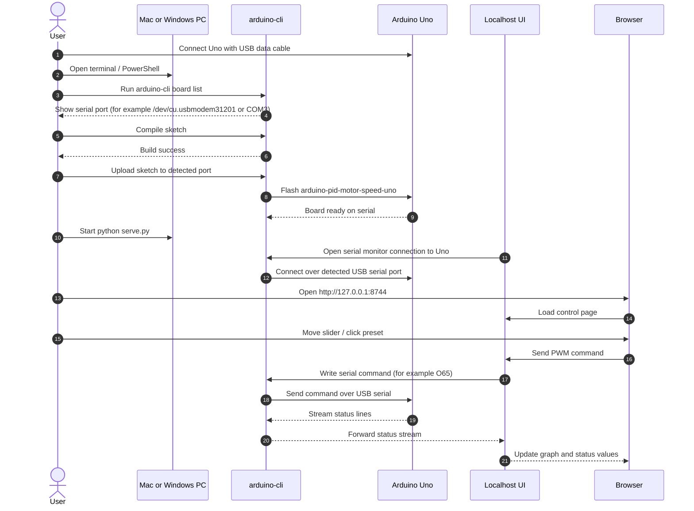

# JuliansProject

A blunt little localhost control panel for an **Arduino Uno motor setup**.

It gives you:
- a local web UI for manual motor control
- quick PWM presets and a live slider
- a live PWM history graph while you drag up and down
- an orange overlay for the reported PID/process variable
- a serial status tail from the board
- optional PID-mode commands for later experiments
- the matching Arduino sketch used for the board

Right now the honest working mode is **manual PWM control**.
The RPM sensor path is still noisy, so closed-loop RPM control is included for experimentation, not trust.

---

## What this project is

This repo has two parts:

1. **Arduino sketch**
   - `arduino/arduino-pid-motor-speed-uno/arduino-pid-motor-speed-uno.ino`
   - Motor PWM is on **pin 3**
   - Sensor input is on **pin 2**

2. **Localhost UI**
   - `serve.py`
   - opens a small web app on your machine
   - talks to the Arduino over serial using `arduino-cli monitor`

---

## Setup sequence diagram



---

## What we found during testing

Manual sweep results on the current setup:

- **0–50** → mostly dead / unreliable
- **~60** → startup threshold
- **65–80** → low usable range
- **90–120** → solid normal range
- **150–255** → high / near max

Important: the reported RPM values are still garbage on the current sensor setup, so do **not** trust PID behavior yet.

---

## Requirements

### macOS or Windows
- Python 3
- [`arduino-cli`](https://arduino.github.io/arduino-cli/latest/)
- an Arduino Uno
- a USB cable that actually carries data (not charge-only)

### Arduino CLI check

```bash
arduino-cli version
arduino-cli board list
```

If your Uno is connected properly, `arduino-cli board list` should show something like:

**macOS:**
```bash
/dev/cu.usbmodem31201 Arduino UNO arduino:avr:uno
```

**Windows:**
```text
COM3 Arduino UNO arduino:avr:uno
```

---

## Physical connection: USB + board

This part needs to be right or localhost will never talk to the board.

### 1. Plug in the Arduino Uno over USB

Use a real USB data cable.
A charge-only cable will power the board but **will not** create a usable serial port.

### 2. Confirm your computer can see the board

Run:

```bash
arduino-cli board list
```

You want to see a real serial device.

**macOS example:**
```bash
/dev/cu.usbmodem31201 Arduino UNO arduino:avr:uno
```

**Windows example:**
```text
COM3 Arduino UNO arduino:avr:uno
```

What matters is the **serial port**:

- macOS: `/dev/cu.usbmodem31201`
- Windows: `COM3`

That is the port the localhost UI will use.

### 3. If you do not see the board

Check these in order:

- unplug and reconnect the USB cable
- try another USB cable
- try another USB port on the computer
- confirm the board powers on
- run again:

```bash
arduino-cli board list
```

If there is still no usable serial port, the problem is below the app layer.

### 4. Do not let another serial tool hold the port open

Only one thing should own the serial port at a time.

Before running the localhost UI, close:
- Arduino IDE Serial Monitor
- other `arduino-cli monitor` sessions
- terminal tools like `screen`, `cu`, etc.

If the port is busy, the UI may load in the browser but it will not control the motor.

**macOS check:**
```bash
lsof -nP | grep usbmodem
```

**Windows PowerShell check:**
There is no exact `lsof` equivalent used in this README, so the practical fix is:
- close Arduino IDE Serial Monitor
- close extra terminals running Arduino tools
- unplug/replug the board if needed

---

## Repo layout

```text
.
├── README.md
├── app.js
├── index.html
├── serve.py
├── setup-windows.bat
├── setup-windows.ps1
├── styles.css
└── arduino/
    └── arduino-pid-motor-speed-uno/
        └── arduino-pid-motor-speed-uno.ino
```

---

## 1. Flash the Arduino sketch

Find your board first:

```bash
arduino-cli board list
```

Use the port shown there.

**macOS example:**
```bash
/dev/cu.usbmodem31201
```

**Windows example:**
```text
COM3
```

Compile:

```bash
arduino-cli compile --fqbn arduino:avr:uno arduino/arduino-pid-motor-speed-uno
```

Upload on macOS:

```bash
arduino-cli upload -p /dev/cu.usbmodem31201 --fqbn arduino:avr:uno arduino/arduino-pid-motor-speed-uno
```

Upload on Windows:

```powershell
arduino-cli upload -p COM3 --fqbn arduino:avr:uno arduino/arduino-pid-motor-speed-uno
```

Replace the example port with the actual port from your machine.

---

## 2. Run the localhost UI

Before starting the localhost UI:

- make sure the Arduino is still plugged in
- make sure no other serial monitor owns the board
- make sure the board was flashed successfully

From the repo root:

```bash
python3 serve.py
```

Then open:

```text
http://127.0.0.1:8744
```

The localhost server talks to the Arduino over the USB serial port.
If the browser loads but the motor does not react, the first thing to check is usually the USB serial connection or a busy port.

### Windows bootstrap script files

- `setup-windows.bat` -> normal double-click launcher
- `setup-windows.ps1` -> actual setup logic

On a Windows machine, the goal is that the user only needs to:
- get the repo onto the machine
- plug in the Uno over USB
- run `setup-windows.bat`

---

## Optional environment variables

You can override the defaults if your port or host is different.

### macOS / bash / zsh

```bash
MOTOR_UI_HOST=127.0.0.1 \
MOTOR_UI_PORT=8744 \
MOTOR_UI_SERIAL_PORT=/dev/cu.usbmodem31201 \
MOTOR_UI_BAUD=115200 \
python3 serve.py
```

### Windows PowerShell

```powershell
$env:MOTOR_UI_HOST = "127.0.0.1"
$env:MOTOR_UI_PORT = "8744"
$env:MOTOR_UI_SERIAL_PORT = "COM3"
$env:MOTOR_UI_BAUD = "115200"
python serve.py
```

---

## How to use it

### Manual mode
This is the mode you should trust right now.

Use the UI to:
- drag the PWM slider
- click preset buttons
- hit **Stop** to send PWM 0

### PID mode
PID mode is wired in, but the RPM feedback is still wrong.
Use only if you are debugging the sensor path.

---

## Serial commands the board understands

The sketch accepts commands like:

- `M1` → manual mode
- `M0` → PID mode
- `O65` → set PWM to 65
- `O0` → stop motor
- `T120` → set RPM target to 120
- `P1.4` → set proportional gain
- `I0.25` → set integral gain
- `D0.04` → set derivative gain

---

## Safety notes

- The UI defaults are meant to be sane, not magical.
- Manual mode is safer than fake closed-loop control.
- Start low and step up.
- If the motor is behaving weirdly, hit **Stop** first.
- If the board is busy, make sure no other serial monitor is holding the port open.

---

## Troubleshooting

### UI loads but motor does nothing
Usually one of these:

1. wrong serial port
2. Arduino not flashed with the matching sketch
3. another serial monitor already owns the port
4. motor driver wiring is wrong

**macOS:**
```bash
lsof -nP | grep usbmodem
```

**Windows:**
- close Arduino IDE Serial Monitor
- close any terminal running `arduino-cli monitor`
- unplug/replug the board
- confirm the COM port again with:

```powershell
arduino-cli board list
```

### `Resource busy` or serial port cannot open
Something else already has the serial port open.
Close other terminal monitors or Arduino Serial Monitor first.

On Windows, this usually means another app is already using `COM3` / `COM4` / similar.

### Motor does not start at low PWM
That is expected on this setup.
The tested startup threshold was roughly **PWM 60**.

### RPM values look insane
Correct. The current sensor path is still noisy/wrong.
That is a hardware/signal-conditioning problem still to solve.

---

## Next improvements

Good next steps if you want to keep building:

- fix the RPM sensor path properly
- make `PULSES_PER_REV` accurate for the sensor
- add percent-power mode in the UI
- add ramp-up / ramp-down controls
- add startup boost logic
- save presets in the browser

---

## Quick start

### Fastest Windows path

- plug in the Arduino Uno
- run `setup-windows.bat`
- wait for the browser to open

### macOS quick start

```bash
git clone <YOUR-REPO-URL>
cd JuliansProject
arduino-cli board list
arduino-cli compile --fqbn arduino:avr:uno arduino/arduino-pid-motor-speed-uno
arduino-cli upload -p /dev/cu.usbmodem31201 --fqbn arduino:avr:uno arduino/arduino-pid-motor-speed-uno
python3 serve.py
```

### Windows one-step setup

If the repo is already on the machine, the intended path is:

1. plug in the Arduino Uno with a USB data cable
2. double-click `setup-windows.bat`

That launcher will try to:
- install Python if missing
- install `arduino-cli` if missing
- install the Arduino AVR core if missing
- detect the Uno COM port automatically
- compile and upload the sketch
- start the localhost UI
- open the browser automatically

If something fails, the script should stop with a blunt error instead of pretending it worked.

### Windows manual fallback (PowerShell)

Replace `COM3` below with the real port shown by `arduino-cli board list`.

```powershell
git clone <YOUR-REPO-URL>
cd JuliansProject
arduino-cli board list
arduino-cli compile --fqbn arduino:avr:uno arduino/arduino-pid-motor-speed-uno
arduino-cli upload -p COM3 --fqbn arduino:avr:uno arduino/arduino-pid-motor-speed-uno
python serve.py
```

Open:

```text
http://127.0.0.1:8744
```

Then try:
- **60**
- **75**
- **100**
- **Stop**

If it does not respond, re-check the board port shown by:

```bash
arduino-cli board list
```
